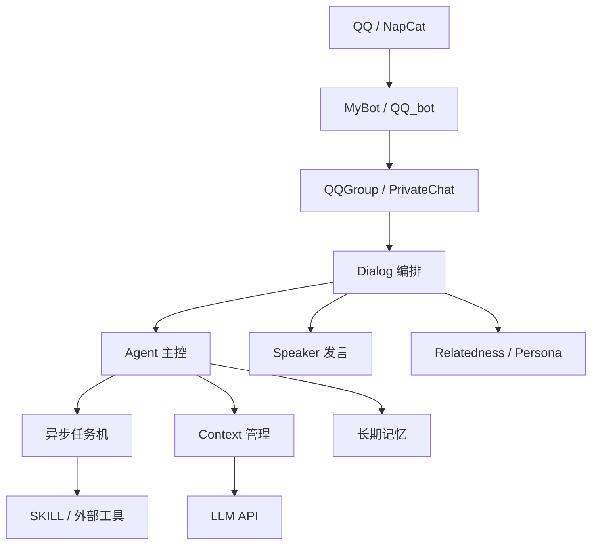
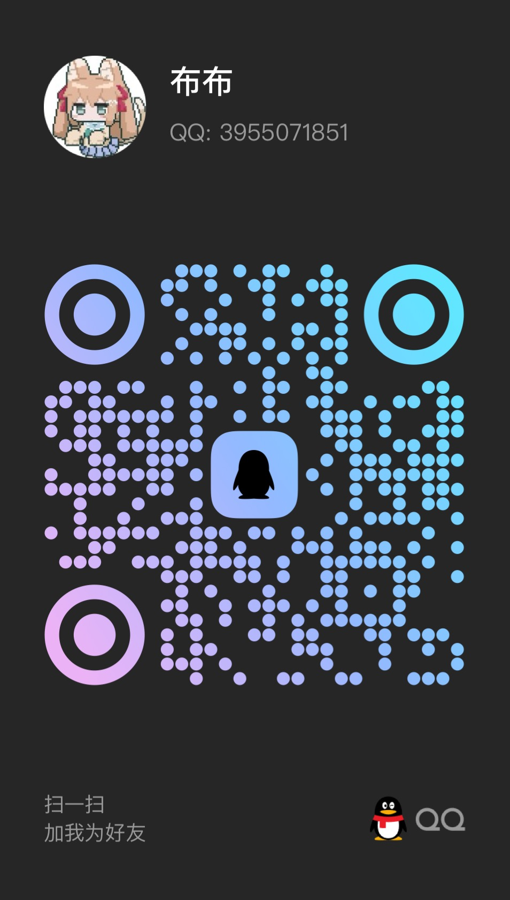

# TIYA - Then I Ask You

一个运行在 QQ 群聊与私聊环境中的个人 AGI 工程 Demo。

TIYA 的重点不是提供开箱即用的聊天机器人产品，而是探索一套能够长期运行的 Agent 架构：主控 Agent、异步任务机、可压缩上下文、分层长期记忆、Persona，以及按需加载的 SKILL。

> 当前文档语言为简体中文。英文 README 与英文文档将在后续补充，完成后会在页面顶部提供语言切换链接。

## 核心设计

- **Agent / Speaker 分离**：Agent 负责理解、规划、工具调用和任务维护，Speaker 负责生成符合角色及场景的最终发言。
- **异步任务机**：工具调用支持优先级、依赖、超时、重试、定时任务和 callback，不必阻塞在单次 LLM 请求中。
- **上下文管理**：分别维护当前窗口、历史窗口、事件历史、任务状态和检查点，长对话可在压缩后继续执行。
- **长期记忆**：采用分层 bucket、递归查询、重排、版本、压缩、拆分和维护服务，而不是简单拼接聊天记录。
- **渐进式 SKILL**：Agent 先发现能力摘要，再按标题读取所需说明，并可将附属 Python 函数注册为工具。
- **群聊关系建模**：通过消息图、话题、对话连续性、成员兴趣和 Persona 参与发言决策。

## 架构概览



一条消息不会被直接送入一个大而全的模型。会话对象先完成解析和路由，Dialog 再根据消息类型、注意力和相关性决定是否唤醒 Agent。Agent 可以创建后台任务、查询记忆或暂不发言；只有形成明确表达目标后，才把任务交给 Speaker。

详细设计参见[总体架构](docs/architecture.md)。

## 真实运行

TIYA 并非只在测试数据上运行的离线原型。项目开发期间一直有实际 Bot 持续在线，Agent、任务机、上下文压缩、群聊相关性和持久化流程都根据真实消息流与实际故障持续调整。

群聊和私聊从会话对象、消息历史、Agent 状态到本地数据目录分别隔离。公开仓库不包含实际账号配置、聊天记录、运行日志、长期记忆或 API Key。

这仍然属于应用层逻辑隔离，不等于进程沙箱或完整权限系统。具体运行方式与数据边界参见[真实运行与持续演进](docs/real-world-operation.md)。

## 快速开始

### 环境

- Python 3.12
- Git
- 已登录 QQ 的 NapCat 实例
- 一个兼容 OpenAI Chat Completions 的模型接口

### 获取并安装

```powershell
git clone <repository-url>
cd TIYA_ThenIAskYou_2026

py -3.12 -m venv .venv
.\.venv\Scripts\Activate.ps1
python -m pip install --upgrade pip
python -m pip install -r requirements.txt
python -m pip install --no-deps -e .
```

项目目前不发布 PyPI 安装包。`requirements.txt` 是依赖安装来源，editable install 只用于把本地 `src/TIYA` 注册到当前虚拟环境。

### 配置并启动

```powershell
python -m TIYA
```

首次运行会生成 `config/config.yaml` 并提示完成配置。至少需要填写：

1. NapCat WebSocket 地址和 token。
2. 一个 LLM 预设的模型、endpoint 和 API key。
3. Agent、群聊和私聊引用的模型预设名称。

完成后再次执行：

```powershell
python -m TIYA
```

Linux/macOS 命令及完整步骤参见[快速开始](docs/quickstart.md)，配置字段参见[配置说明](docs/configuration.md)。

## 文档

| 文档 | 内容 |
| --- | --- |
| [文档入口](docs/index.md) | 项目定位与推荐阅读顺序 |
| [总体架构](docs/architecture.md) | 组件边界、消息流、并发与持久化 |
| [已知限制](docs/limitations.md) | 权限、沙箱、私聊和记忆的当前边界 |
| [Agent 与任务机](docs/agent-runtime.md) | ReAct、任务状态、Worker、依赖与 callback |
| [上下文与记忆](docs/context-and-memory.md) | Context 压缩、恢复和长期记忆引擎 |
| [群聊相关性与轻量 NLP](docs/relatedness.md) | 消息图、话题、新词、连续性和低配适应 |
| [SKILL 系统](docs/skills.md) | 能力发现、渐进加载和工具注册 |
| [真实运行与持续演进](docs/real-world-operation.md) | 在线 Bot、会话隔离和测试反馈循环 |
| [快速开始](docs/quickstart.md) | clone、环境、首次配置和启动 |
| [配置说明](docs/configuration.md) | 模型、NapCat、群聊、私聊与可选模块 |

长期记忆模块已解耦为独立项目：[Ricoz217/CoMe_context_memory](https://github.com/Ricoz217/CoMe_context_memory)。

## 已知限制

TIYA 仍处于个人项目演进阶段，目前需要明确承认以下限制：

- Agent 权限管理模块尚未完成，不能针对不同工具和操作分别授权。
- 没有接入真正的运行沙箱，动态 Python 工具和脚本仍在本机执行。
- 私聊链路只达到最低可运行状态，主要开发重心和更完整体验都在群聊。
- 记忆架构仍然偏厚重，对多 Agent 共享记忆的支持尚不理想。

因此，项目适合在受信任、可观察的本地环境中作为 Demo 运行，不应直接作为面向陌生用户的自主执行服务部署。完整说明参见[已知限制](docs/limitations.md)。

## 测试

```powershell
python -m pytest -q tests
```

自动化测试覆盖配置、Agent 任务协议、上下文与记忆、相关性、群聊/私聊流程和可选模块的核心逻辑。真实 NapCat、模型效果和第三方服务需要在本地环境中单独验证。

## 项目状态

TIYA 是用于展示和继续验证 AGI 工程思路的个人 Demo，不是通用 Agent 框架。项目会优先继续完善权限、沙箱、私聊体验和多 Agent 记忆边界。

## DEMO 账号

<p align="center">
  
</p>

你可以添加这个账号，私聊、拉入群聊。私聊会立即进入 Agent 链路，但还不完善。群聊功能相对完整，效果很好。  
主要差距在于，群聊有大量真实聊天记录的语料，作为 few-shot 载入。而私聊没有这些 few-shot，同时也没有一个很合适的触发系统，只是照搬了群聊的。

## License

本项目使用 [MIT License](LICENSE)。
