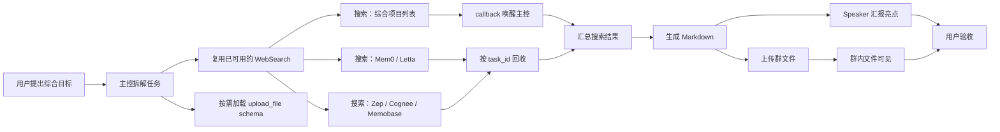

# 综合任务执行展示：GitHub Agent Memory 调研与群文件交付

> 任务日期：2026-07-31  
> 运行会话：QQ群 `806869605`  
> 运行实例：`\\RICOLAPTOP\Python\TIYA_ThenIAskYou_2026`  
> 证据类型：OneBot 原始事件、应用日志、Agent 调试日志、同版本源码  
> 展示原则：仅保留说明任务链路所需的信息，成员身份和无关聊天内容不展开。

## 结论摘要

这次任务展示了一条完整的 Agent 交付闭环：用户只用自然语言描述目标，主控自行识别所需能力，按需加载尚未暴露的上传工具，并行搜索多个方向，通过 callback 和任务 ID 汇合结果，生成 Markdown 文件，上传到群文件，再由 Speaker 用简短消息汇报；用户最终明确回复“可以，你过关”。



从正式任务提出到文件出现在群里约 **91 秒**，到文字汇报约 **110 秒**，到用户明确验收约 **134 秒**。

---

## 一、任务起点与完成标准

### 时间点校正

- `17:43:48`：用户先询问“再复杂一点的任务能不能做到？”
- `17:44:54`：用户给出可执行的完整任务要求。

正式要求是：

```text
去 GitHub 上找关于 Agent 记忆的前沿开源项目，
整理成 Markdown 报告，并发到群里。
```

OneBot 原始日志同时证明该事件来自目标群：

```text
\\RICOLAPTOP\Python\TIYA_ThenIAskYou_2026\logs\bot_20260730.log.2026-07-31:50233
```

该事件包含：

```text
group_id = 806869605
message_time = 2026-07-31 17:44:54
```

主控据此推导出四个完成条件：

1. 搜索与 Agent Memory 相关的 GitHub 项目；
2. 汇总、比较并形成结构化内容；
3. 写成 Markdown 文件；
4. 上传到群文件并向用户汇报。

用户没有指定具体工具名，也没有逐步指导执行过程。

---

## 二、完整任务时间线

| 时间 | 阶段 | 证据与行为 |
|---|---|---|
| 17:44:54 | 正式任务到达 | 用户要求搜索项目、整理 Markdown、发到群里。 |
| 17:45:00 | 规划与能力准备 | 主控启动首个 WebSearch，同时加载 `upload_file` 的详细 schema。 |
| 17:45:04 | 并行扩展 | 再启动两个不同搜索方向。 |
| 17:45:35 | 进度反馈 | Speaker 在群内回复已经接单。 |
| 17:45:39 | 第一批结果 | 第一个搜索任务通过 callback 返回。 |
| 17:45:42 | 结果汇合 | 主控根据任务 ID 获取另外两个搜索结果。 |
| 17:46:05 | 内容生成 | 主控判断资料足够，开始写 Markdown。 |
| 17:46:06 | 文件完成 | 得到 `%TEMP%\agent_memory_report.md`。 |
| 17:46:14 | 交付启动 | 并行调用群文件上传与 Speaker 汇报。 |
| 17:46:25 | 文件可见 | 群内出现 `<file:agent_memory_report.md>`。 |
| 17:46:44 | 完成汇报 | Speaker 通知报告完成，并提炼三个亮点。 |
| 17:47:08 | 用户验收 | 用户回复“可以，你过关”。 |
| 17:48:09 | 正式上传回执 | 上传子任务返回 `success=True`、文件 hash 和消息 ID。 |

主要应用日志：

```text
\\RICOLAPTOP\Python\TIYA_ThenIAskYou_2026\logs\2026-07-31\app.log
```

关键行号：

- `app.log:9198`：正式任务原文；
- `app.log:9207`：主控确认任务规划；
- `app.log:9471-9473`：群内接单反馈；
- `app.log:9554`：搜索完成，准备生成报告；
- `app.log:9562`：准备上传与汇报；
- `app.log:9572`：文件实际出现在群内；
- `app.log:9586-9589`：结果摘要；
- `app.log:9592`：用户验收。

---

## 三、按需加载：主控在任务到达后才补齐上传能力

这是本案例中很容易被忽略、但非常值得展示的设计。

### 日志证据

在 `17:45:00`，主控同一轮执行了两个动作：

```text
run_external_tool(websearch.search)
load_external_tool(group_chat.upload_file)
```

对应位置：

```text
debug.log:108054-108058
```

日志显示：

- `websearch.search` 已经在当前上下文可用，主控直接复用；
- `upload_file` 此前尚未向主控暴露详细请求格式；
- 确认任务最终需要“发到群里”后，主控才调用 `load_external_tool` 获取参数 schema；
- 返回的 schema 明确要求 `file` 和 `upload_filename`，主控随后按该格式调用。

因此，这次实际证明的是：

> 外部能力可以预先注册在能力目录中，但不需要把每个工具的完整参数说明永久放入 LLM Context；主控在任务确实需要某项能力时，再加载该工具的详细调用格式。

### 代码证据一：默认只向 LLM 注入少量元工具

位置：[`BaseAgent._tools_input`](../src/TIYA/agent/agent.py#L442)

```python
self.tools[self.list_external_tools.__name__] = self.list_external_tools
self.tools[self.load_external_tool.__name__] = self.load_external_tool
self.tools[self.run_external_tool.__name__] = self.run_external_tool

def _tools_input(self):
    tools = [ToolInput(tool) for tool in self.tools.values()]
    self.control.add_tools(tools)
    self._context.current_window.extend(tools)
```

外部业务工具保存在注册表中，但不会全部作为顶层 ToolInput 注入主控。主控始终拥有的是“列出能力、加载调用说明、执行外部工具”三个通用入口。

### 代码证据二：能力摘要与详细 schema 分离

位置：[`BaseAgent.list_external_tools`](../src/TIYA/agent/agent.py#L2819) 与 [`BaseAgent.load_external_tool`](../src/TIYA/agent/agent.py#L2837)

```python
def list_external_tools(self) -> dict:
    # 只返回 source_name、tool_name 和 description
    ...

def load_external_tool(self, source_name: str, tool_name: str) -> dict | str:
    function = self._functions[call_name]
    instruction = build_tool_payloads(function)["openai"]["function"]
    return {
        "source_name": source_name,
        "tool_name": tool_name,
        **instruction
    }
```

这是一种渐进式能力暴露：

```text
能力目录摘要
    ↓ 确认需要
单个工具的完整 schema
    ↓ 参数校验
通用执行器创建异步任务
```

它带来的价值包括：

- 避免把所有工具 schema 一次性塞进 Context；
- 减少无关工具对 LLM 决策的干扰；
- 只有任务需要时才消耗对应说明的 token；
- 工具可以按来源注册，并通过统一执行器调用；
- 加载后的 schema 仍会经过确定性参数校验。

### SKILL 层采用相同的渐进式思路

位置：[`SkillManager.load_skill`](../src/TIYA/agent/agent_skill.py#L146)

```python
def load_skill(self, skill_name: str) -> dict:
    skill = self.skills[skill_name]
    skill.last_use = time.time()
    return skill.md_title_tree.copy()
```

`load_skill` 首先只返回 `SKILL.md` 的标题树，而不是立即把整份说明注入 Context；主控可再按所需标题读取内容，必要时还可以从 SKILL 的 Python 文件注册新工具。

需要准确区分：**本次任务直接触发的是 `upload_file` 的工具级按需加载，没有在这一时刻新加载完整 SKILL。** `websearch.search` 和 `set_content` 当时已经可用，所以被直接复用。这种“缺什么补什么、已有能力直接复用”的行为本身就是惰性加载设计发挥作用的证据。

---

## 四、三路搜索并行扇出，再按任务 ID 汇合

主控实际启动了三条搜索：

```text
github agent memory open source project Mem0 Letta Zep Cognee 2025
agent memory framework github trending 2025 MemGPT Letta Mem0 stars
Zep Cognee Memobase agent memory github project
```

任务 ID 分别为：

```text
333512295952391
333512314916864
333512314920960
```

第一条搜索在完成后通过 callback 唤醒主控。主控收到结果后，没有重复搜索，而是直接调用：

```python
get_task_data(task_id="333512314916864")
get_task_data(task_id="333512314920960")
```

证据位置：

- `debug.log:108055`：首条搜索；
- `debug.log:108071-108072`：另外两条搜索；
- `debug.log:108115-108170`：首条搜索 callback 及任务 ID；
- `debug.log:108176-108180`：按 ID 回收另外两个结果。

### 对应代码一：外部工具默认创建子任务

位置：[`BaseAgent.run_external_tool`](../src/TIYA/agent/agent.py#L2862)

```python
sub_task = await self.add_task(
    call_name,
    arguments,
    name=name,
    call_id=call_id,
    callback=callback,
    wait=wait
)

if sub_task.is_wait:
    await sub_task.event.wait()
    return sub_task.results["result"]
else:
    return f"已创建外部工具任务[{sub_task.id}]"
```

非等待模式下，主控很快得到任务 ID，可以继续规划，不会被单个网络请求锁住。

### 对应代码二：任务状态与结果查询

位置：

- [`BaseAgent.list_tasks_status`](../src/TIYA/agent/agent.py#L2765)
- [`BaseAgent.get_task_data`](../src/TIYA/agent/agent.py#L2780)

```python
if task.status not in done_statuses:
    if not wait:
        result = task.to_llm()
        result["result"] = "Task Running"
        return result

return task.to_llm()
```

长任务不要求 LLM 阻塞等待。主控可以先查看状态，再按任务 ID 获取完成结果。

### 对应代码三：多 Worker 并行执行

位置：[`AgentWorkerManager`](../src/TIYA/agent/agent_runtime.py#L156)

```python
if max_worker is None:
    max_worker = SETTING_CFG.Agent.MaxWorker  # 默认4

...

for _ in range(adds):
    self.workers.append(Worker(self))
```

本次三路搜索与群聊中的其他任务交错执行，仍然能够通过任务 ID 回到正确的主控流程。这比“整个会话等待一次长请求”更适合真实群聊环境。

---

## 五、搜索结果驱动报告生成

首个搜索结果包含：

- Agent Memory 项目和论文合集；
- Mem0、Letta/MemGPT、Graphiti、Cognee；
- Memobase、LangMem 等路线；
- 多种记忆架构的比较资料。

其余两条搜索补充了项目定位、架构特点、Stars 参考、许可证和评测资料。

在三个结果汇合后，主控才判断：

```text
搜索结果很丰富，信息足够整理报告了。
```

随后调用 `set_content`，生成：

```text
%TEMP%\agent_memory_report.md
```

证据：

- `debug.log:108179-108180`：补充搜索结果；
- `debug.log:108184-108186`：写入完整 Markdown 并取得文件路径。

最终报告包含：

- Agent Memory 背景及主流技术路线；
- 七个核心项目对比表；
- 五个重点项目详解；
- LoCoMo、LongMemEval、DMR 等评测基准；
- 按场景给出的选型建议；
- 延伸项目和论文资源。

这证明报告不是在收到任务后立即凭模型内部知识生成，而是发生在多路搜索结果回收之后。

---

## 六、文件交付与对话汇报分离

### 文件上传

主控在 `17:46:14` 调用：

```text
upload_file(
    file="%TEMP%/agent_memory_report.md",
    upload_filename="agent_memory_report.md"
)
```

群内在 `17:46:25` 出现文件消息。正式回执为：

```json
{
  "success": true,
  "message_id": "999115912",
  "hash_name": "49172679343ea424b4987bf4f4b8020f",
  "upload_filename": "agent_memory_report.md",
  "message": "文件上传成功"
}
```

证据：

- `debug.log:108191-108193`：上传和汇报任务启动；
- `app.log:9572`：群文件实际出现；
- `debug.log:109451`：结构化成功回执。

### 对应上传代码

位置：[`GroupChatAgent.upload_file`](../src/TIYA/agent/group_chat_agent.py#L1671)

```python
file_path = self._skills._resolve_path(file)
if file_path.is_file():
    hash_name = await add_file_async(file_path)
else:
    hash_name = file

success, response = await self._host.upload_group_file(
    hash_name,
    upload_filename
)
if not success:
    raise RuntimeError(f"文件[{file}]上传失败")
```

完整上传链路为：

- `GroupChatAgent.upload_file`：[`group_chat_agent.py:1671-1709`](../src/TIYA/agent/group_chat_agent.py#L1671)
- `GroupDialog.upload_group_file`：[`group_dialog.py:106-112`](../src/TIYA/dialog/group_dialog.py#L106)
- `QQGroup.upload_group_file`：[`qq_group.py:814-836`](../src/TIYA/qq_group.py#L814)
- OneBot API：[`group_api.py:149-180`](../src/TIYA/api/group_api.py#L149)

### Speaker 只发送摘要

完整报告由文件承载；Speaker 没有把全文刷进群里，只通知文件名并提炼了几个亮点：

```text
报告写完了，群文件自取。
Mem0 和 Letta 的路线差异值得看。
Memobase 的画像思路与当前系统有相似之处。
```

这是合理的信息分层：

- 文件负责完整交付；
- Speaker 负责状态通知和内容导览；
- 群聊中保持简短可读。

---

## 七、用户验收形成完整闭环

`17:47:08`，用户回复：

```text
可以，你过关
```

证据：

- `app.log:9592`
- `debug.log:109743-109746`

因此这次任务具有四类独立完成证据：

1. 日志中存在完整 Markdown 内容；
2. 群内出现真实文件消息；
3. 上传工具返回结构化成功回执；
4. 用户明确确认任务通过。

---

## 八、这次任务最能展示的系统能力

| 能力 | 真实表现 |
|---|---|
| 自然语言规划 | 从一句目标描述推导出搜索、汇总、写文件、上传和汇报步骤。 |
| 惰性加载 / 动态加载 | 发现交付需要群文件能力后，才加载 `upload_file` 的详细 schema。 |
| 能力复用 | 已可用的 `websearch.search` 和 `set_content` 不重复加载。 |
| 并行工具调用 | 三路搜索同时执行，缩短调研时间。 |
| 异步任务管理 | 网络任务进入后台，主控通过 callback 和任务 ID 汇合结果。 |
| 实时会话共存 | 搜索期间仍能处理群聊中的其他消息和 Speaker 任务。 |
| 跨工具组合 | WebSearch、任务机、文件写入、文件缓存、群文件上传和 Speaker 串成完整工作流。 |
| 产物交付 | 结果不是一句口头回答，而是可下载的 Markdown 文件。 |
| 用户验收 | 用户在群内明确确认“过关”。 |

一句话概括：

> 主控不是预先背着所有工具说明等待指令，而是在理解任务后按需补齐能力，再把多个异步工具组合成一次可验证的文件交付。

---

## 九、审计边界与改进点

### 1. 这是 Web 调研，不是仓库源码审计

实际执行方式是：

```text
WebSearch → 搜索结果摘要 → 综合整理
```

系统没有执行 `git clone`，也没有逐仓库检查源码、release、commit 或完整 README。因此适合称为：

> 基于 GitHub 项目及相关资料的自动调研报告。

不应称为：

> 对多个 GitHub 仓库完成源码级审计。

### 2. 部分资料来自搜索摘要和二手比较

报告结构完整，但 Stars、融资额和评测分数等时效性数据没有逐条标注来源日期。部分结论来自项目页之外的比较文章或其他仓库的竞品说明。

适合作为快速技术选型概览，不应替代逐项目的一手资料核验。

### 3. 上传阶段存在轻微的乐观汇报竞态

主控在 `17:46:14` 同时启动上传和 Speaker，并把状态描述为“已上传”。正式上传 callback 到 `17:48:09` 才返回。

本次没有造成错误，因为文件在 `17:46:25` 已实际出现，完成发言在 `17:46:44` 才发送。但更严谨的流程应为：

```text
开始上传
→ 查询或等待上传结果
→ success=True
→ 再声明“上传成功”
```

如果希望尽快反馈，可以先说“报告已生成，正在上传”，成功后再确认。

### 4. 临时产物的长期可复核性有限

当前服务器中已经找不到同名临时文件或对应 hash 缓存文件。现有证据仍包括日志中的完整 Markdown、群文件消息和上传回执，但若用于长期审计，建议把最终报告额外归档到任务记录目录。

---

## 十、展示时的建议讲法

可以按下面顺序在 3–5 分钟内讲解：

1. **先展示原始任务**：用户只说找项目、写 Markdown、发群，没有告诉 Agent 用什么工具。
2. **强调按需加载**：主控发现需要群文件交付，才加载 `upload_file` schema；已有搜索和写文件能力直接复用。
3. **展示三路并行搜索**：三个任务 ID 同时存在，第一条 callback 唤醒主控，另外两条按 ID 回收。
4. **展示真实产物**：日志保留 Markdown 正文，群内出现文件，上传接口返回成功结构。
5. **用用户验收收尾**：用户回复“可以，你过关”，形成结果闭环。

最后补充一句边界说明：这次证明的是多工具 Web 调研与文件交付，不是逐仓库源码审计。

---

## 十一、快速定位证据

```powershell
$logs = '\\RICOLAPTOP\Python\TIYA_ThenIAskYou_2026\logs'

# 原始群事件及 group_id
rg -n '比如说去 github 上找前沿开源项目' `
  "$logs\bot_20260730.log.2026-07-31"

# 任务规划、按需加载和三路搜索
rg -n 'load_external_tool.*upload_file|agent memory framework|Zep Cognee Memobase' `
  "$logs\2026-07-31\debug.log"

# Markdown 生成与文件上传
rg -n 'agent_memory_report\.md|文件上传成功' `
  "$logs\2026-07-31\debug.log"

# 群内文件、完成汇报和用户验收
rg -n 'agent_memory_report\.md|可以，你过关' `
  "$logs\2026-07-31\app.log"
```

## 十二、代码定位索引

| 模块 | 函数 / 类 | 讲解重点 |
|---|---|---|
| `agent.py` | `BaseAgent._tools_input` | 默认只注入少量元工具。 |
| `agent.py` | `BaseAgent.list_external_tools` | 返回外部能力摘要。 |
| `agent.py` | `BaseAgent.load_external_tool` | 按需返回单个工具的完整 schema。 |
| `agent.py` | `BaseAgent.run_external_tool` | 校验参数并创建外部工具子任务。 |
| `agent.py` | `BaseAgent.add_task` | 设置任务优先级、重试、依赖和 callback。 |
| `agent.py` | `BaseAgent.list_tasks_status` | 查看并发任务状态。 |
| `agent.py` | `BaseAgent.get_task_data` | 按任务 ID 回收结果。 |
| `agent_runtime.py` | `AgentWorkerManager` | 管理多个并发 Worker。 |
| `agent_runtime.py` | `Worker.worker_loop` | 执行、超时、重试和 callback。 |
| `agent_skill.py` | `SkillManager.load_skill` | 渐进式返回 SKILL 标题树。 |
| `group_chat_agent.py` | `GroupChatAgent.upload_file` | 文件解析、缓存、上传和结构化回执。 |
| `group_dialog.py` | `GroupDialog.upload_group_file` | Agent 到群会话的上传桥接。 |
| `qq_group.py` | `QQGroup.upload_group_file` | 群对象级上传。 |
| `group_api.py` | `upload_group_file` | OneBot 文件上传 API。 |

