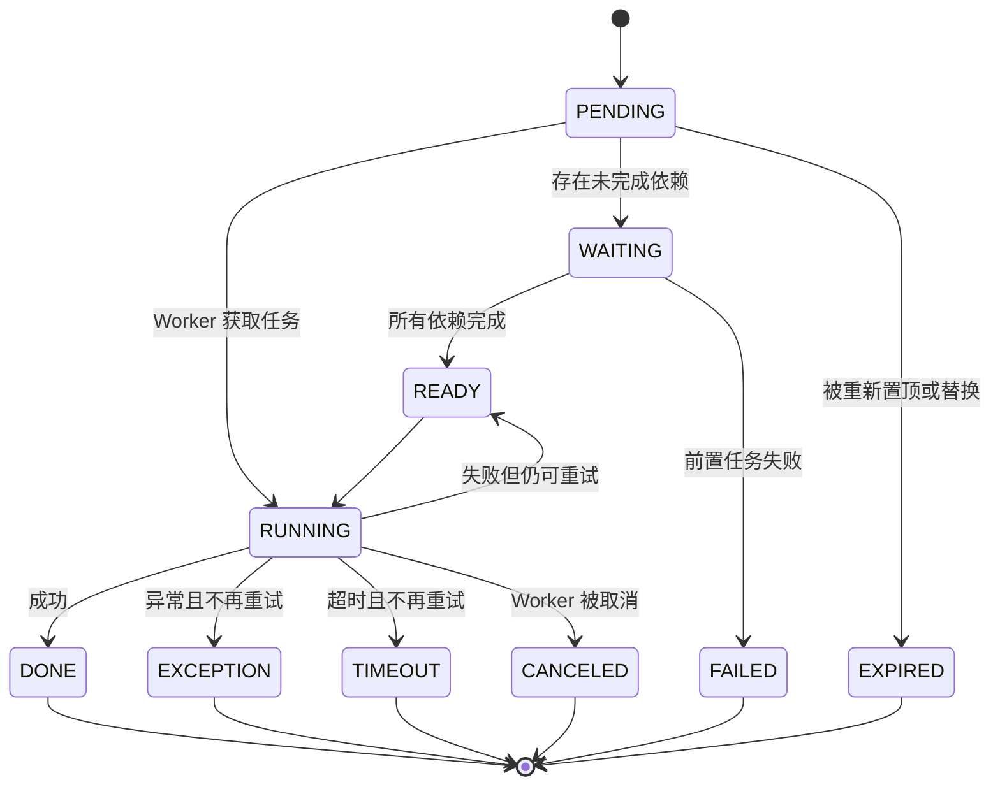

# Agent 与任务机

## 为什么需要任务机

普通聊天机器人通常在一次模型请求中完成全部工作：接收消息、调用工具、等待结果、生成回复。这个模式遇到慢速搜索、文件处理、多工具并发或跨轮任务时，很容易让主控上下文被阻塞。

TIYA 将“决定做什么”和“实际执行工具”拆开：

```text
Agent 主控请求
    -> 生成 Tool Call
    -> 创建 AgentTask
    -> Task Runtime 执行
    -> 保存结果和状态
    -> 按 callback 策略重新唤醒 Agent
```

因此，一次 Agent 请求可以创建多个任务后结束。工具在后台运行，完成时再把结果带回主控，而不是要求模型连接一直等待。

## Agent 的一次运行

`BaseAgent` 提供通用主控能力，`GroupChatAgent` 和 `PrivateChatAgent` 注入不同的业务工具、prompt 和回调信息。一次运行大致包含：

1. Dialog 根据消息和触发原因请求 Agent 运行。
2. Agent 合并系统 prompt、初始化信息、当前消息、通知和任务摘要。
3. LLM 返回文本、工具调用，或者两者的组合。
4. 普通控制工具立即修改 Agent 状态；外部工具被转换为 `AgentTask`。
5. 需要等待的调用在当前轮收集结果，不等待的调用进入后台。
6. Agent 根据结果继续 ReAct，或者挂起并等待 callback。
7. 当主控决定输出内容时，将发言目标交给 Speaker。

主控拥有 ReAct 次数、请求超时和失败重试上限。连续请求失败时可以回退上一轮上下文；达到循环限制后会暂停继续自请求，避免无界工具循环。

## AgentTask 数据模型

任务不仅保存一个函数和参数，还包含运行控制信息：

| 字段 | 含义 |
| --- | --- |
| `function` | 实际可调用工具及其注册名称 |
| `input_params` | 结构化工具参数 |
| `priority` | 数字越小越先执行 |
| `dependents` | 当前任务开始前必须完成的任务 ID；名称沿用现有代码 |
| `blocks` | 反向记录被当前任务阻塞的任务 |
| `retry_limit` / `attempt` | 重试上限和已尝试次数 |
| `timeout` | 单任务超时，未设置时使用 Worker 默认值 |
| `callback` | 完成后是否重新调用主控 |
| `event` | 供等待方感知终态 |
| `results` / `exceptions` | 成功结果和异常历史 |

普通任务和定时任务共用基础结构。`AgentScheTask` 额外保存触发规则、上次触发时间、下次运行时间和暂停状态。

## 状态机



`AgentTaskQueue` 使用优先队列保存可运行任务，并通过 `asyncio.Condition` 唤醒等待的 Worker。加入带依赖的任务时会检查依赖链是否成环，同时调整优先级，确保前置任务能先被调度。

如果依赖任务仍在运行，当前任务保持 `WAITING`；依赖全部成功后转为 `READY`；任一依赖失败、异常、取消或超时，当前任务转为 `FAILED`，不会带着不完整输入继续执行。

## Worker 执行

`AgentWorkerManager` 维护可动态调整数量的 Worker。每个 Worker 持续执行以下循环：

1. 等待任务机恢复运行。
2. 从优先队列取得一个可执行任务。
3. 将任务 ID 写入 `contextvars.ContextVar`，使任务内部创建的子任务能够追踪来源。
4. 异步函数直接 `await`；同步函数连同当前 context 一起提交到共享线程执行器。
5. 应用超时和重试规则。
6. 写入结果或终态，触发 callback，并唤醒依赖任务。

任务机可以暂停接收执行、恢复执行、调整 Worker 数量，也可以取消正在处理指定任务的 Worker。

## Callback 策略

后台结果是否值得再次消耗一次 LLM 请求，由任务自己的 callback 模式决定：

| 模式 | 行为 |
| --- | --- |
| `NEVER` | 记录完成状态，不主动运行主控 |
| `EXCEPTION` | 只在异常、超时或依赖失败时运行主控 |
| `ALWAYS` | 无论成功失败都带着结果运行主控 |
| `CALL` | 只处理本次工具结果，不展开完整主动运行 |

例如网络搜索默认不阻塞 Agent，并在结果就绪后 callback；简单状态读取可以等待并直接返回；无需立即处理的维护任务只写入任务历史。

多个结果短时间内完成时，Agent 会合并 callback 信息，降低连续唤醒造成的上下文抖动和模型调用次数。

## 定时任务

Agent 可以创建一次性或周期性任务。触发条件使用 `Trigger` 表达，可包含年月日、星期、时分秒、起止时间和 jitter。调度层由 APScheduler 驱动，但任务触发后仍进入统一的 Agent 任务与 callback 流程。

任务定义和调度状态会保存到 Agent 数据目录。重新启动时，工具名称会重新映射到当前 Python 函数；无法找到对应工具的旧任务会被跳过，避免执行已经不存在的代码。

## Agent 与 Speaker 的边界

Agent 负责“要不要说、需要知道什么、应当完成什么任务”；Speaker 负责“最终怎么说”。这样做有几个工程收益：

- 主控上下文可以保留工具和任务细节，发言上下文只保留表达所需信息。
- 可以给 Agent 和 Speaker 配置不同模型、token 限制与轮数限制。
- 后台任务完成后，Agent 可以继续判断，而不是直接把工具原始结果发给用户。
- 群聊和私聊可以共享任务机，同时使用不同的发言策略和 Persona。

Speaker 的输出仍经过会话对象发送并重新写入消息历史，使 Bot 自己的发言成为后续上下文和关系建模的一部分。

## 可恢复性

Agent 的持久化不是只保存最终聊天文本。它分别记录：

- 事件历史：用户请求、LLM 请求与响应、任务创建与完成、上下文压缩等。
- 当前和历史 Context 窗口。
- 待执行与已完成任务。
- 定时任务。
- 最近检查点。

恢复时会重新绑定工具函数，并将中断在 `RUNNING` 的普通任务转回 `READY`。这保证了进程重启后任务机不会把“上次运行到一半”误认为已经完成。

当前 `AgentHistoryManager` 已具备事件记录和检查点恢复，通用 `undo` / `redo` 接口仍是预留设计，不应视为已经完成的用户功能。

## 权限边界

任务机负责判断任务何时执行、如何重试以及何时 callback，但当前不会对每个工具操作执行独立授权。已注册工具在 Python 进程权限范围内运行，任务状态机本身不是权限系统。

按 Agent、工具、操作、路径和用户身份授权的权限模块尚未完成，相关安全边界参见[已知限制](limitations.md)。
