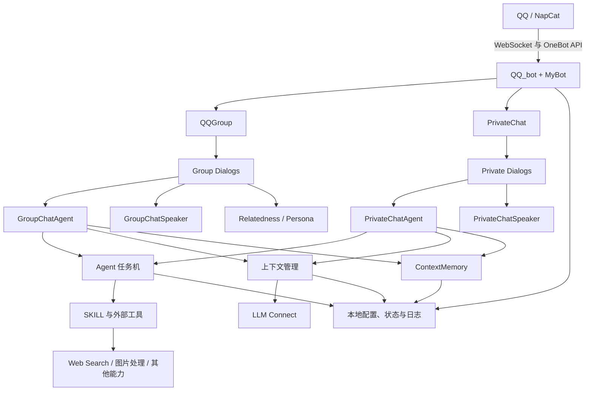
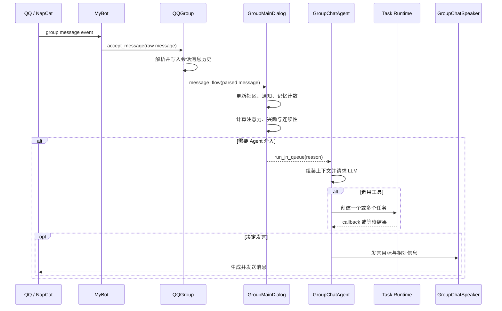

# 总体架构

## 设计目标

TIYA 把 QQ 聊天视为一个持续发生、信息不完整、任务可能跨越多轮对话的环境。系统需要同时处理即时回复、后台工具、长期状态和多人关系，因此核心设计不是单次“消息进、文本出”，而是一个持续运行的 Agent Runtime。

当前架构围绕以下目标组织：

- 将消息接入、对话编排、推理决策和实际发言分层。
- 允许耗时工具脱离主控请求并发执行，并在完成后重新唤醒 Agent。
- 在上下文窗口有限的情况下保留任务状态、已加载能力和关键历史。
- 将可增长的长期记忆放到独立引擎中，而不是无限堆入 prompt。
- 让群聊与私聊共享底层能力，同时保留不同的触发策略和关系模型。

## 组件视图



## 分层职责

### 1. 接入与进程层

`TIYA.QQ_bot` 是运行入口，负责：

- 加载并校验配置。
- 配置 ncatbot 和 NapCat WebSocket。
- 注册群消息、私聊消息、通知和请求事件。
- 初始化已有群、可选模块、日志与长期记忆单例。
- 协调保存、热重载、正常关闭和重启。

`MyBot` 对 ncatbot 的 WebSocket 和 API 路由做适配，并持有实际事件循环。主线程保留本地命令入口，Bot 网络循环运行在独立线程中，其他长期工作通过该事件循环调度。

### 2. 会话容器层

每个群对应一个 `QQGroup`，每个活跃私聊用户对应一个 `PrivateChat`。会话容器拥有自己的：

- 消息历史和消息解析流程。
- 串行/并行任务队列。
- Dialog 列表。
- 主 Agent、Speaker、Persona 与通知状态。
- 自动保存、缓存和本地数据目录。

群聊对象常驻于 `QQ_GROUPS`；私聊对象按需创建，并由回收任务关闭长期空闲实例。

### 3. Dialog 编排层

Dialog 是消息进入认知模块前的路由层。它将不同类型的交互拆开处理，例如命令、临时管理会话和普通聊天。

群消息按以下顺序尝试处理：

```text
GroupCommandDialog -> GroupMainDialog -> 临时 Dialog
```

私聊会先检查临时 Dialog，再进入 `PrivateMainDialog`。任一 Dialog 都可以消费消息并停止后续传播。

主 Dialog 不直接把消息交给一个“大而全”的模型。它先提交消息、更新通知和社区状态，再根据回复、@、注意力和相关性等信号决定是否唤醒 Agent。

### 4. 认知与执行层

这一层由四个角色协作：

| 角色 | 职责 |
| --- | --- |
| Agent | 理解当前事件、规划下一步、调用工具、创建任务并处理 callback |
| Task Runtime | 排队和执行工具，处理优先级、依赖、超时、重试和任务完成通知 |
| Speaker | 根据 Agent 指令、角色、消息和相对信息生成实际发言 |
| Persona | 提供用户、群组、角色和长期关系的结构化信息 |

Agent 与 Speaker 分离是重要边界。Agent 可以选择不发言、先获取信息或等待后台任务；Speaker 只在收到明确发言任务后组织表达。这让“思考”和“说话”拥有不同上下文与模型配置。

### 5. 能力与状态层

- `agent/agent_skill.py` 管理 SKILL 说明、附属工具和脚本。
- `memory/` 提供分层长期记忆引擎。
- `relatedness/` 为群聊计算消息关联、话题、连续性和成员兴趣。
- `LLM_connect.py` 统一模型请求、工具调用、token 统计和上下文阈值。
- Web 搜索、图片识别、自动收藏与 Pixiv 等模块作为可选工具接入。

其中 relatedness 是群聊体验的重要组成，而不是附属统计。它使用本地轻量 NLP 和有界消息图，在不调用实时 LLM 的情况下判断话题、兴趣与对话连续性。详细设计参见[群聊相关性与轻量 NLP](relatedness.md)。

## 一条群消息的处理路径



群聊不会对每条消息无条件请求 LLM。`AttentionSpeakProbability` 提供随互动变化的基础注意力，`BotCommunity` 再提供话题兴趣和对话连续性分数；回复或 @ 可以强制唤醒，普通消息则经过概率门控。这种设计控制成本，也让 Bot 更像群聊参与者而不是每句必答的问答接口。

私聊复用同样的 Agent / Speaker / Memory 结构，但触发策略更直接，Persona 更偏向单用户长期关系，也不需要群聊社区图。

这里的“复用”描述的是代码结构，不代表体验成熟度相同。当前私聊链路只达到最低可运行状态，项目的主要设计和调优工作集中在群聊，群聊体验明显更完整。

## 并发模型

TIYA 同时使用线程和 `asyncio`：

- 主线程负责启动、终端命令与进程生命周期。
- Bot 线程持有 ncatbot 事件循环和 WebSocket 连接。
- 会话中的 `Aqueue` 避免同一对象上的关键流程互相踩踏。
- Agent Worker 并发执行工具；同步函数进入共享执行器，异步函数直接在事件循环中等待。
- 自动保存、记忆总结、相关性维护、图片处理等工作以后台任务运行。

这不是“所有任务全部并行”。消息提交、上下文变更和发言等有顺序要求的步骤由队列或锁保护，搜索、下载、分析等耗时操作才被拆到后台。

## 持久化边界

运行状态默认落在项目目录下：

```text
config/config.yaml                本地配置与密钥
data/groups_data/<group-id>/      群历史、Agent、Persona、相关性等状态
data/private_chats_data/<user-id>/ 私聊状态
data/memory/                      长期记忆引擎
data/token_usage/                 模型用量
logs/                             运行日志
```

这些运行数据和配置已被 `.gitignore` 排除。仓库中的 `data/prompt/`、`data/skill/` 和 `data/character/` 是程序定义的一部分，会随源码提交；用户产生的数据、缓存和密钥不会作为项目内容上传。

Agent 还会单独保存事件历史、当前上下文、任务、定时任务和检查点。进程退出后，未完成任务可以重新装载；原本处于 `RUNNING` 的普通任务会恢复为可执行状态。

## 当前边界

TIYA 是个人 Demo，不是多租户服务，也没有将本地数据层抽象成数据库后端。当前实现优先验证 Agent 工程结构和长期运行行为，因此配置、状态和索引主要使用 YAML、JSON 与 NDJSON 文件。

外部接口、模型返回和 QQ 平台行为仍可能导致运行时错误。任务重试、超时、原子写入、检查点和降级路径用于提高可恢复性，但不等同于生产环境的高可用保证。

更重要的是，当前 Agent 权限管理尚未完成，SKILL 和脚本也没有运行在真正的沙箱中；私聊链路的成熟度低于群聊，记忆模块仍偏厚重且不擅长多 Agent 共享。详细说明参见[已知限制](limitations.md)。
