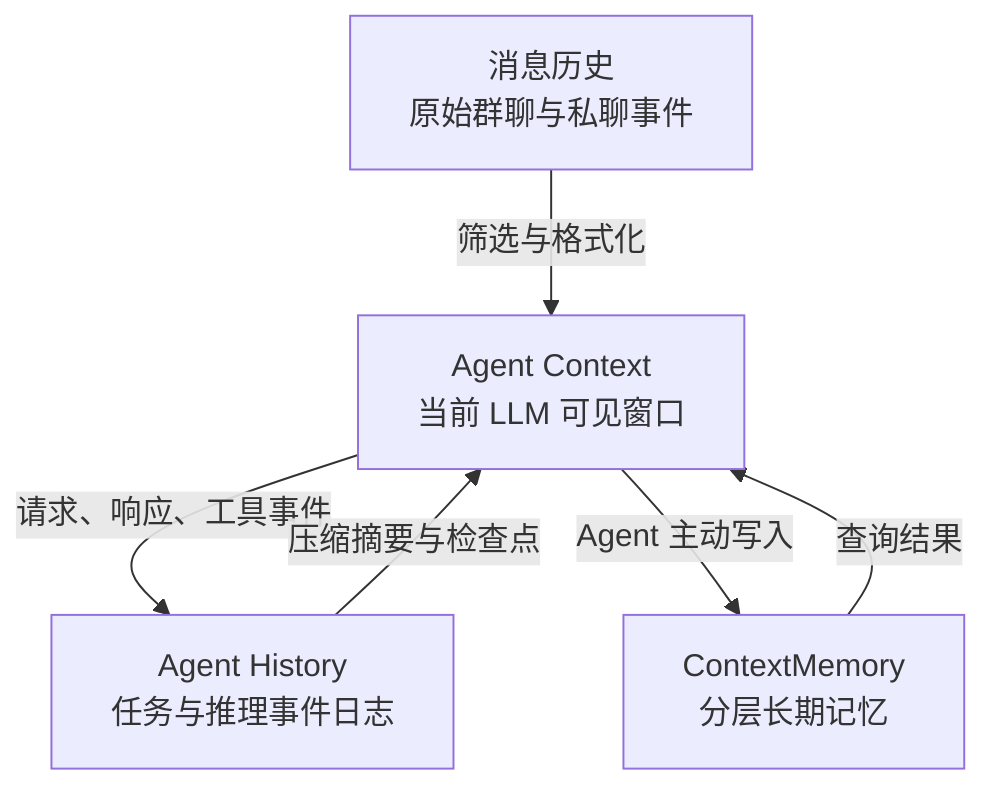
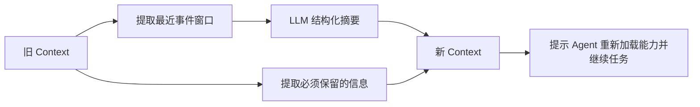

# 上下文与记忆

TIYA 中的“上下文”和“记忆”不是同一个对象。前者服务于正在进行的推理，后者服务于跨会话、跨压缩窗口的长期信息保留。将它们拆开，是系统能够持续运行而不把全部历史塞进模型窗口的基础。

记忆模块已经从 TIYA 解耦为独立项目：[Ricoz217/CoMe_context_memory](https://github.com/Ricoz217/CoMe_context_memory)。本章描述的是 TIYA 当前集成的实现；独立仓库用于继续演进记忆模块本身。

## 四个信息层次



### 消息历史

群聊和私聊各自维护结构化消息历史。消息对象可以包含文本、回复关系、@、图片和其他 QQ 元素，并在需要送入模型时转换为统一表示。

消息历史是环境事实来源，但不会原样无限进入 Agent。Dialog、Agent prompt 和 Speaker 会按场景截取最近消息，图片等内容也可以先经过缓存或识别再进入模型。

### Agent Context

`LLM_connect.Context` 保存模型真正可见的系统 prompt、对话消息、工具定义、工具调用轮次和 token 使用信息。`AgentContext` 在它外面再管理：

- 一个 `current_window`。
- 有上限的历史窗口 `window_history`。
- 窗口切换时保留系统 prompt 和工具定义。

Context 可以序列化并在重启后恢复。工具函数不会直接序列化 Python 对象，而是保存注册名称，加载时再通过函数映射重新绑定。

### Agent History

`AgentHistoryManager` 是事件日志，而不是另一个聊天列表。它记录：

- 用户和系统发起的请求。
- LLM 请求与响应。
- 任务创建、完成和定时触发。
- 上下文压缩与系统 prompt 重载。

事件历史用于恢复、压缩摘要和调试。检查点同时引用当时的历史事件、Context 和任务状态，让系统能够回到一个内部一致的快照。

### ContextMemory

`ContextMemoryEngineV3` 保存需要跨越窗口和进程长期存在的信息。Agent 通过业务 SKILL 暴露的 `add_memory`、`query_memory` 等工具使用它，而不是让模型直接操作底层文件。

长期记忆包含结构、版本、证据和维护状态，适合保存用户偏好、关系事实、长期计划和可重复使用的知识，不适合代替短期消息队列。

## 上下文窗口如何增长

一次 Agent 循环会向 Context 追加用户输入、LLM 响应、Tool Call 和 Tool Response。模型配置中的 `max_context` 给出窗口上限，`auto_compress_rate` 给出自动压缩比例。

请求前，连接层会结合最近一次 token 使用和新输入估算完整窗口大小。当预计使用量达到压缩阈值时，控制权交给 `BaseAgent.compress_context()`。压缩比例在运行时限制在 0.3 到 0.9 之间，避免过早或过晚触发。

## 压缩不是简单摘要

压缩流程需要同时解决三件事：缩短历史、保留执行状态、避免工具协议断裂。



压缩前会生成检查点，并从事件历史中构造结构化摘要输入。新的窗口至少保留：

- 系统 prompt 和已注册工具。
- 当前外部工具列表。
- 已经按需读取过的 SKILL 章节。
- 已加载的外部工具说明。
- 进行中任务和需要关注的任务信息。
- 尚未接入完整轮次的 Tool Response、用户请求和图片。

如果摘要模型失败，系统仍会开启新窗口并保留 pinned 信息，这是一个以“能够继续工作”为目标的降级路径。新窗口还会提示 Agent 检查外部工具、重新读取所需 SKILL 内容并继续未完成任务。

压缩不会自动把所有旧对话转成长久记忆。真正值得长期保存的内容应由 Agent 通过记忆工具明确写入，或者由会话层的自动记忆总结流程生成。

## 长期记忆的数据模型

ContextMemory 使用树状 bucket 组织记忆。bucket 可以包含记忆记录，也可以包含指向子 bucket 的节点，从而把不断增长的数据拆成可检索的局部空间。

存储大致分为：

```text
data/memory/
  index/                   全局状态、bucket 树、查询缓存、迁移日志
  buckets/<bucket-id>/     bucket 上下文、事件和别名
  memories/<key>/          每条记忆的版本文件
  jobs/                    可恢复的拆分/导入任务
```

记忆记录采用 revision，而不是原地覆盖后丢失旧值。索引同时保存 bucket 拓扑、别名映射、事件和 schema version，为迁移、审计和故障恢复提供基础。

## 写入与维护

记忆引擎将较复杂的行为拆成服务：

| 服务 | 职责 |
| --- | --- |
| `IngestService` | 导入文件和外部内容 |
| `QueryService` | 递归检索、局部评分和结果合并 |
| `AdvanceQueryService` | 对较大 bucket 树执行分块、归并式查询 |
| `BucketTopologyService` | 管理 bucket 与句柄重定向 |
| `BucketSummaryService` | 维护 bucket 摘要 |
| `CompressSplitService` | 压缩或拆分容量过高的 bucket |
| `OptimizeService` | 重组、归档和清理低价值结构 |
| `MaintenanceService` | 过期清理、统计和 GC |
| `SplitIngestJobService` | 恢复未完成的拆分导入任务 |

引擎通过 bucket 锁避免同一结构被并发修改，通过原子 JSON 写入降低中断造成的损坏风险。内存中的对象还有容量和空闲淘汰策略，脏数据不会被当作普通缓存直接丢弃。

自动管理可以根据 bucket 压力触发压缩或拆分，并使用冷却时间、每轮次数和最小收益约束限制反复重组。优化过程中还会校验叶子保留率，避免为了缩小结构而过度丢失可检索信息。

## 查询路径

普通查询从目标 bucket 开始递归展开：

1. 根据查询模式构造局部候选。
2. 结合 BM25、字符局部相似度与可选 LLM 判断。
3. 选择值得继续展开的子 bucket。
4. 合并局部结果和全局召回加权。
5. 返回匹配记录、分数及最终回答材料。

高级查询面向超过单次上下文承载能力的大型树。它将 bucket 信息打包为多个 token 受控的 box，分块请求模型，再归并中间结果；`best_effort` 路径允许部分节点失败时继续返回已有结果。

这种设计的重点不是追求单一向量检索指标，而是让记忆结构能够增长、维护和解释。当前实现使用本地文本索引与 LLM 重排，没有要求独立向量数据库。

## Persona 与相关性

Persona 是记忆的消费结果之一，但不是 ContextMemory 的简单别名。群 Persona、成员 Persona 和私聊 Persona 会从消息、长期信息和关系状态中构造适合当前场景的结构化描述，并设置独立缓存周期。

`relatedness` 则是群聊侧的短中期关系信号。它维护消息图、话题快照、对话连续链、新词和成员兴趣，并给 Bot 返回 `interest` 与 `continuity` 分数。这些分数参与“是否介入群聊”的判断，但不代替长期事实记忆。

完整算法和性能设计参见[群聊相关性与轻量 NLP](relatedness.md)。

可以把两者简单区分为：

```text
ContextMemory：过去有哪些值得长期找回的内容？
Relatedness：当前这段群聊和我有多相关，是否仍处于同一话题链？
```

## 设计取舍

- **本地文件优先**：便于观察和演示内部状态，但不适合多实例并发共享。
- **显式记忆优先**：避免把每条聊天都永久化，也要求 Agent 对“什么值得记住”作出判断。
- **摘要与原始事件并存**：摘要服务于新 Context，原始事件服务于恢复和调试。
- **结构维护可失败**：压缩、拆分和优化是增强路径，失败不应破坏原有可读数据。

当前实现也存在明显代价：模块职责和维护流程偏多，对简单场景显得厚重；本地状态模型更适合单 Agent 或单进程使用，对多 Agent 共享记忆时的身份、权限、写入冲突和一致性支持仍不理想。详细说明参见[已知限制](limitations.md)。
