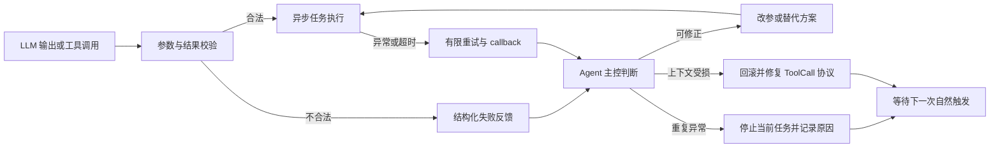

# Agent 容错机制：真实运行日志审计

> 审计范围：2026-07-31 00:00 至 2026-08-02 日志采集时点（按自然日口径）  
> 运行实例：`\\RICOLAPTOP\Python\TIYA_ThenIAskYou_2026`  
> 证据类型：服务器运行日志 + 同版本源码  
> 展示原则：聊天内容、账号标识和与结论无关的信息均已省略；用户指定的非展示模块不纳入案例。

## 结论摘要

近三天的真实运行记录表明，TIYA 的容错不是单纯捕获异常，而是一条分层闭环：



本报告选取三个相互补充的案例：

1. **LLM 工具参数错误**：主控根据校验信息自行改参；工具返回空数据后改用已有信息继续完成任务。
2. **发言 LLM 输出为空**：主控有限重试，连续失败后停止当前任务并说明原因，避免死循环。
3. **上游 LLM 服务持续 503**：框架回滚对话、解除失效关联并补全未闭环 ToolCall，服务恢复后继续运行。

---

## 案例一：工具参数错误后自行纠正，并对空结果降级处理

### 发生了什么

2026-08-01 15:46，主控调用 `get_member_persona` 时，把 LLM 生成的 `target`、`query` 作为参数传入。工具 schema 实际要求 `user_id`。

参数校验器没有让错误参数进入真实工具，而是返回了可供主控理解的结构化错误：

```text
target：存在未声明参数
query：存在未声明参数
user_id：缺少必填参数
```

四秒后，主控明确判断“参数传错了”，将调用改为：

```json
{"user_id": "<已脱敏>"}
```

正确调用返回 `{}`，表示没有可用画像。主控没有继续重复查询，而是改用已有记忆构造 `speak`，任务进入执行。

### 日志时间线

| 时间 | 日志证据 | 主控行为 |
|---|---|---|
| 15:46:21 | `debug.log:56027-56028` | LLM 生成了包含 `target`、`query` 的错误调用。 |
| 15:46:21 | `debug.log:56096-56097` | 工具返回 `ToolArgumentsError`，准确指出多余参数和缺少的 `user_id`。 |
| 15:46:25 | `debug.log:56102-56104` | 主控声明“参数传错了”，使用 `user_id` 重新调用。 |
| 15:46:26 | `debug.log:56105-56106` | 正确调用完成，但业务结果为空对象。 |
| 15:46:35 | `debug.log:56112-56114` | 主控判断“画像暂无记录”，使用已有记忆继续调用 `speak`。 |

日志文件：

```text
\\RICOLAPTOP\Python\TIYA_ThenIAskYou_2026\logs\2026-08-01\debug.log
```

### 对应代码一：调用前进行 schema 校验

位置：[`BaseAgent.run_external_tool`](../src/TIYA/agent/agent.py#L2881)

```python
function = self._functions[call_name]
check = validate_tool_arguments(function, arguments)
if not check.ok:
    raise ToolArgumentsError(
        f"调用外部工具[{tool_name}]传入参数有误: "
        f"\n{[e.to_dict() for e in check.issues]}"
    )
```

这一层是确定性保护：LLM 即使生成了语法正确但 schema 错误的参数，也不会直接执行目标工具。

### 对应代码二：任务异常有限重试并回调

位置：[`Worker.worker_loop`](../src/TIYA/agent/agent_runtime.py#L53)

```python
except Exception as E:
    _log.error(E)
    _log.debug(traceback.format_exc())
    if task.retry_limit > 0 and task.attempt < task.retry_limit:
        task.set_exception(E)
        task.set_ready()
        await self._host.manager.add(task)
    else:
        task.set_exception(E, True)
        self._callback(task)
```

Runtime 不会把工具异常变成整个 Agent 的未捕获异常。它保留异常、执行有限重试，并最终通过 callback 把结果交回主控。

### 这个案例证明了什么

- 错误参数会被 schema 校验拦截。
- 失败原因不是模糊的 `tool failed`，而是主控可消费的字段级信息。
- 主控能够根据错误信息改写参数。
- 工具成功但没有数据时，主控能够切换到已有记忆，而不是把空结果误当成答案或无限查询。

---

## 案例二：发言 LLM 连续返回空内容，主控停止任务并报告原因

### 发生了什么

2026-07-31 12:06，一次 `speak` 任务没有得到任何可发送消息。Speaker 将失败标记为“可重试”，并向主控返回具体原因及建议。

主控只重试了一次。第二次仍然得到相同错误后，主控在运行轨迹中明确报告：

```text
连续两次 speak 失败（发言 LLM 未返回内容），
按照提示这可能属于系统异常，我停止继续重试，等待下一次触发。
当前无其他后台任务需要处理。
```

约两分钟后，新的独立触发正常完成。这说明被跳过的是当前失败任务，并没有让 Agent 会话永久失效。

### 日志时间线

| 时间 | 日志证据 | 主控行为 |
|---|---|---|
| 12:06:52 | `debug.log:28988` | Speaker 返回“未返回可发送的消息内容”，标记为可重试。 |
| 12:06:56 | `debug.log:29004-29005` | 主控决定只重新调用一次。 |
| 12:07:00 | `debug.log:29010` | 第二次仍为相同错误。 |
| 12:07:03 | `debug.log:29026` | 主控停止继续重试并记录原因。 |
| 12:08:50 | `debug.log:29457` | 后续独立触发走正常成功分支。 |
| 12:12:19 | `debug.log:31005` | 另一次并发场景中，主控发现已有发言在途，主动不重复调用，避免刷屏。 |

日志文件：

```text
\\RICOLAPTOP\Python\TIYA_ThenIAskYou_2026\logs\2026-07-31\debug.log
```

### 对应代码一：严格检查 Speaker 输出

位置：[`GroupChatSpeaker.speak`](../src/TIYA/agent/group_chat_agent.py#L513)

Speaker 对响应类型、JSON、必需字段、消息序列、消息类型、重复 key 和空内容逐层校验。空内容的处理为：

```python
if not clean_content:
    self.mark_failure(
        "发言 LLM 未返回可发送的消息内容",
        retryable=True
    )
    continue
```

相关检查集中在 [`group_chat_agent.py:577-684`](../src/TIYA/agent/group_chat_agent.py#L577)。这意味着“HTTP 请求成功”并不等同于“发言结果有效”。

### 对应代码二：失败分类和下一步建议

位置：[`_speaker_failure_guidance`](../src/TIYA/agent/group_chat_agent.py#L408)

```python
if retryable:
    return (
        "这是可重试失败，可根据当前聊天需要再次调用 speak；"
        "如果连续触发相同错误，可能是系统异常，"
        "请停止继续重试并等待下一次触发。"
    )

return "这是不可重试失败，请勿重试，等待下一次自然触发。"
```

### 对应代码三：把原因回调给主控

位置：[`GroupChatAgent.speak`](../src/TIYA/agent/group_chat_agent.py#L1203)

```python
if result is None:
    if not failure_reason:
        speaker = getattr(self._host, "SPEAKER", None)
        if speaker is not None:
            failure_reason = getattr(speaker, "last_failure_reason", "")
            failure_retryable = getattr(speaker, "last_failure_retryable", False)

    next_action = _speaker_failure_guidance(failure_retryable)
    message = f"发言任务[{task_id}]失败。原因: {failure_reason}。{next_action}"
    # 将具体失败原因作为 callback 再次交给主控
    ...
    return message
```

完整失败回调位于 [`group_chat_agent.py:1276-1299`](../src/TIYA/agent/group_chat_agent.py#L1276)。成功分支最终返回 `None`，见 [`group_chat_agent.py:1301-1314`](../src/TIYA/agent/group_chat_agent.py#L1301)，因此日志中的 `response: None` 在这里表示正常完成，不是“无内容失败”。

### 这个案例证明了什么

- Speaker 的错误输出会被业务级验证识别，而不是直接发送。
- 系统区分可重试和不可重试失败。
- 主控能够识别“同类错误重复发生”，停止当前任务并留下明确原因。
- 下一次自然触发仍然可以工作，失败不会无限传播。
- 主控还会查询并发任务状态，避免已有发言在途时重复调用。

---

## 案例三：上游服务持续 503，回滚并修复 ToolCall 上下文

### 发生了什么

2026-07-31 15:31 起，上游 LLM 服务连续返回：

```text
503 Service is too busy
```

达到重试上限后，系统没有继续在已经损坏的对话窗口上叠加请求，而是：

1. 回退到上一轮完整对话；
2. 解除即将失效的原生 ToolCall 关联，但保留后台任务；
3. 为未闭环 ToolCall 构造“协议已中止”的补全响应；
4. 服务恢复后，从有效 Context 继续调用工具。

### 日志时间线

| 时间 | 日志证据 | 系统行为 |
|---|---|---|
| 15:31:48 | `error.log:87` | 上游首次记录 503。 |
| 15:31:52 | `error.log:91` | 当前 Agent 请求失败。 |
| 15:33:16 | `error.log:102-104` | 达到上限，回退上一轮；解除一个未结算 ToolCall；补全未闭环响应。 |
| 15:37:29 | `error.log:128-130` | 故障持续期间再次触发相同保护，没有累积坏 Context。 |
| 15:37:35 | `debug.log:74671` | 服务恢复后重新调用 `speak`。 |
| 15:38:35 | `debug.log:74681` | 发言链路正常完成。 |

日志文件：

```text
\\RICOLAPTOP\Python\TIYA_ThenIAskYou_2026\logs\2026-07-31\error.log
\\RICOLAPTOP\Python\TIYA_ThenIAskYou_2026\logs\2026-07-31\debug.log
```

### 对应代码一：达到请求上限后回退

位置：[`BaseAgent.run`](../src/TIYA/agent/agent.py#L1148)

```python
if self._retry_times >= 3:
    self._context.current_window.back2last_round()
    detached_notice = self._detach_tool_calls_for_context_reset(
        "连续请求失败，自动回退上一轮对话"
    )
    if detached_notice:
        prompts = Prompts(TextPrompt("user", detached_notice), prompts)
    self._retry_times = 0
```

相关实现位于 [`agent.py:1183-1196`](../src/TIYA/agent/agent.py#L1183)。

### 对应代码二：解除失效关联但保留后台任务

位置：[`BaseAgent._detach_tool_calls_for_context_reset`](../src/TIYA/agent/agent.py#L1105)

```python
self._last_call_ids.clear()

return (
    "# Context 更换时解除的 TOOL CALL\n\n"
    f"原因：{reason}\n\n"
    "以下 ToolCall 的原生 ToolResponse 通道已经失效，"
    "但后台任务没有被取消。"
    "需要结果时请调用 get_task_data，也可以先查看任务状态。"
)
```

这种处理避免了两个极端：既不继续等待已经失效的原生响应，也不因为 Context 回滚就粗暴取消可能仍有价值的后台任务。

### 对应代码三：修补未闭环 ToolCall

位置：[`Chat._payload_constructor`](../src/TIYA/LLM_connect.py#L1580)

```python
for call_id, tool_call in pending_tool_calls.items():
    normalized_prompts.append(ToolResponse(
        function_name=tool_call.function_name,
        call_id=call_id,
        response={
            "system": {
                "status": "协议已中止",
                "messages": reason
            }
        }
    ))
```

完整补全逻辑位于 [`LLM_connect.py:1595-1616`](../src/TIYA/LLM_connect.py#L1595)。孤立 ToolResponse 则会从原生工具协议中剔除，并降级为普通通知，见 [`LLM_connect.py:1624-1650`](../src/TIYA/LLM_connect.py#L1624)。

### 这个案例证明了什么

- 重试有明确上限，不会永久轰炸上游服务。
- 系统能恢复到上一轮完整对话，而不是继续使用半截 Context。
- ToolCall / ToolResponse 协议损坏会被主动修补，避免后续 API 请求因为协议不完整而继续失败。
- 后台任务和原生响应关联被区分处理，恢复操作不会无条件丢弃任务。

---

## 三类容错分别由谁负责

| 层次 | 主要模块 | 负责的问题 | 典型动作 |
|---|---|---|---|
| 输出校验层 | `group_chat_agent.py` | LLM JSON、字段、消息类型或内容不合法 | 拒绝发送、记录具体原因、标记是否可重试 |
| 工具边界层 | `agent.py` | 工具不存在、来源错误、参数不符合 schema | 在执行前拒绝，并生成字段级错误 |
| 异步执行层 | `agent_runtime.py` | 工具异常、超时、取消 | 有限重试、保存异常、callback |
| 主控决策层 | Agent LLM | 收到失败后如何继续 | 改参、换数据源、有限重试、停止任务 |
| 上下文协议层 | `agent.py`、`LLM_connect.py` | 连续请求失败、未闭环 ToolCall、孤立 ToolResponse | 回滚、解除关联、补全或降级协议消息 |

关键点是：**确定性代码负责建立护栏，Agent 主控负责在护栏提供的信息上作适应性决策。** 两者缺一不可。

## 审计边界

这组证据可以支持以下表述：

- 系统能识别并阻止一部分错误 LLM 输出进入真实工具或消息发送链路。
- 工具错误会转化为主控可理解、可追踪的信息。
- 主控在真实运行中确实做出过改参、降级、停止重试和等待下一次触发的决定。
- 上游故障后，系统具备 Context 和工具协议的自愈机制。

不应过度声称：

- 容错不等于每个任务最终都成功；案例二就是有意放弃当前失败任务。
- “报告原因”首先指写入日志并 callback 给主控，不保证每次都向群聊额外发送故障通知。
- 主控停止重复错误目前包含基于提示语的语义判断，不是所有错误类型都有独立的硬编码熔断器。
- 三天日志只能证明这些机制在观察窗口内实际触发并工作，不能替代长期 SLA 或故障注入测试。

## 展示时的建议讲法

可以按下面的顺序在 3–5 分钟内讲清楚：

1. **先讲案例一**：LLM 写错参数，代码先拦截；主控读懂错误后改对；工具没数据，再换已有记忆完成。这是最直观的“Agent 自纠错”。
2. **再讲案例二**：不是所有错误都值得一直重试。系统让主控尝试一次，确认同类错误持续后停止并说明原因。这体现可控失败，而不是死循环。
3. **最后用案例三收尾**：即使故障发生在上游服务，框架也会回滚 Context、修补工具协议，保证下一次请求还有干净的起点。

一句话总结：

> TIYA 的容错不是假设 LLM 永远正确，而是把 LLM 和工具都视为可能失败的组件：先校验，再反馈，由主控选择修正、降级或停止，必要时由框架修复上下文协议。

## 快速定位证据

在 PowerShell 中可以使用以下只读命令复核关键记录：

```powershell
$logs = '\\RICOLAPTOP\Python\TIYA_ThenIAskYou_2026\logs'

# 案例一：错误参数、自行改参和空结果降级
rg -n '参数传错了|ToolArgumentsError|画像暂无记录' `
  "$logs\2026-08-01\debug.log"

# 案例二：空输出、有限重试和停止当前任务
rg -n '未返回可发送|连续两次 speak 失败|不再重复调用' `
  "$logs\2026-07-31\debug.log"

# 案例三：503、回滚和 ToolCall 修补
rg -n '503|回退上一轮|未闭环 ToolCall|解除.*ToolCall' `
  "$logs\2026-07-31\error.log"
```

## 版本一致性

生成本报告时，以下本地源码与服务器源码的 SHA-256 均一致，因此文中的相对源码链接与服务器运行版本对应：

- `src/TIYA/agent/agent.py`
- `src/TIYA/agent/agent_runtime.py`
- `src/TIYA/agent/group_chat_agent.py`
- `src/TIYA/LLM_connect.py`
