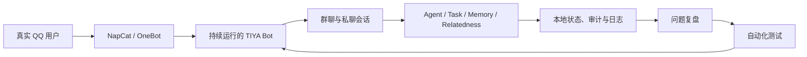

# 真实运行与持续演进

TIYA 不是只在测试数据上运行的离线原型。项目开发期间一直有实际 Bot 持续在线，主要功能在真实群聊消息、真实上下文增长和真实运行故障中逐步演进。

本章不提供虚构的在线时长或消息数量，只说明当前真实运行方式、会话隔离边界，以及线上经验如何回到代码和测试。

## 为什么真实运行重要

Agent 系统在短时间演示中很容易显得正常。真正持续运行后，问题通常来自更长的时间尺度：

- 群聊消息并不围绕 Bot 展开，大量内容与 Bot 无关。
- 同一时间可能存在多个群、私聊、后台任务和模型请求。
- 上下文持续增长，需要压缩后继续工作。
- 图片解析、网络搜索和第三方 API 可能延迟、超时或失败。
- 用户会重复、跳跃、引用旧消息，也会创造群内新词。
- 进程会重启，任务、记忆和会话状态需要恢复。
- 模型输出并不稳定，prompt 和工具协议需要根据真实失败调整。

TIYA 的任务机、上下文检查点、自动保存、群聊相关性和动态词表，并不是为了补齐架构图而单独加入。它们大多对应持续在线运行中实际出现过的问题。

## 运行形态



Bot 使用独立的本地配置和运行数据。仓库只包含源码、prompt、内置 SKILL、角色模板和自动化测试，不包含实际账号配置、聊天记录、运行日志、长期记忆或 API Key。

在线 Bot 本身可以作为项目演示，但不会为了演示而向任意用户开放全部工具。当前尚未完成权限管理和沙箱，因此高风险 SKILL、脚本能力和管理命令只适合在受信任环境中使用。

## 会话隔离

TIYA 的群聊和私聊不是共享一个消息列表再依赖 prompt 区分来源，而是从对象和存储路径开始隔离。

### 群聊

每个群号对应独立的 `QQGroup`，并拥有自己的：

- `MessageManager` 消息历史。
- `Aqueue` 会话任务队列。
- Command Dialog 与 Main Dialog。
- Group Agent、Speaker 和 Persona。
- `GroupRelatedness`、BotCommunity 与成员社区状态。
- 自动收藏、新闻、持久化文件和日志 block。

群数据位于：

```text
data/groups_data/<group-id>/
```

相关性图、话题和成员兴趣也位于该群目录内，不会把不同群的消息放进同一个社区模型。

### 私聊

每个用户对应独立的 `PrivateChat`，并拥有自己的消息历史、队列、Dialog、Agent、Speaker、Persona、收藏索引和持久化状态。

私聊数据位于：

```text
data/private_chats_data/<user-id>/
```

私聊对象按消息到达创建，空闲后保存并回收；再次收到消息时从自己的目录恢复。

### Agent 状态

Agent 的事件历史、Context、普通任务、定时任务和检查点都保存在宿主会话的数据目录中。工具结果和 callback 回到创建它们的 Agent，而不是进入一个全局对话窗口。

长期记忆在同一个引擎内使用不同 bucket 和句柄区分群、成员与私聊目标。业务工具负责选择目标 bucket，模型不会直接拼接其他会话的本地文件。

## 隔离的边界

上述机制可以显著降低普通业务流程中的跨会话串线，但它属于应用层逻辑隔离，不是操作系统级安全边界。

以下基础设施仍由进程共享：

- Python 进程、事件循环与部分线程执行器。
- 全局配置、模型预设和 API 客户端能力。
- ContextMemory 引擎实例及其底层存储根目录。
- 日志基础设施和部分全局缓存。
- 外部 LLM、搜索和图片服务。

因此，会话隔离不能替代 Agent 权限管理、运行沙箱和第三方数据合规。自定义工具如果绕过业务接口直接读取本地文件，仍可能突破应用层边界；这也是项目将权限和沙箱列为主要未完成项的原因。

## 从线上问题回到测试

项目采用的实际演进路径是：

1. 从持续运行中发现异常行为或边界场景。
2. 在脱敏后提炼出最小可复现输入。
3. 将问题固定为单元测试或集成测试。
4. 修改实现并运行完整回归。
5. 重新部署到在线 Bot，继续观察真实分布。

当前自动化测试覆盖 Agent 任务协议、配置迁移、上下文与记忆、群聊相关性、私聊生命周期、图片处理和可选模块。测试不会直接包含真实聊天记录和真实密钥。

测试仍然不能代替线上观察。模型质量、NapCat 行为、第三方 API、长时间资源使用和真实用户互动只能在实际运行中验证；线上运行也不能代替可重复测试，两者承担不同职责。

## 可展示的工程证据

即使不准备大量截图或视频，持续在线的 Bot 仍能证明以下能力：

- 系统能够处理真实而非预设的消息流。
- 多会话和后台任务能够长期共存。
- 本地状态能够跨重启恢复。
- 架构会根据真实失败持续调整，而不是停留在一次性 Demo。

公开展示时应避免暴露群号、用户身份、原始聊天、日志、记忆和 token。若以后公布运行指标，应从脱敏统计中准确生成，并写明统计口径，而不是估算。

## 当前定位

持续在线不等于生产级服务。TIYA 当前没有正式 SLA、完整权限系统、真正运行沙箱或多实例数据层。更准确的定位是：

> 一个在真实 QQ 环境中长期运行、用真实问题推动演进的个人 Agent 工程项目。

安全和成熟度边界参见[已知限制](limitations.md)。
