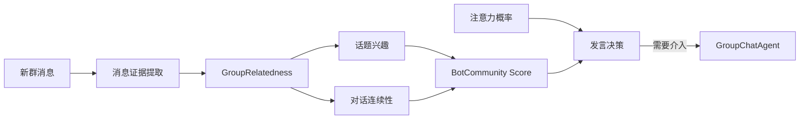

# 群聊相关性与轻量 NLP

`TIYA.relatedness` 是群聊链路中的本地社区建模模块。它试图回答的不是“这句话的标准答案是什么”，而是：

- 当前消息与最近哪些消息相关？
- 群里正在形成哪些话题？
- Bot 对这些话题是否表现过兴趣？
- 当前消息是否延续了 Bot 已参与的对话链？
- Bot 此刻是否值得介入群聊？

模块以轻量 NLP、有限窗口消息图和后台统计为核心，不要求向量数据库，也不在实时路径调用 LLM。它适合在普通个人电脑上随 Bot 一起持续运行。

## 设计出发点

relatedness 的价值不只在于实现了一组 NLP 算法，更在于它针对群聊环境做了一次明确的工程取舍：不把“语义能力”直接等同于大模型、词向量或 BERT，而是优先利用社交软件天然存在的关系证据。

### 为什么不直接使用词向量或 BERT

词向量、Sentence Transformer 或 BERT 类模型是合理方案，但不是这个场景下没有代价的默认答案。

首先，它们会提高服务端配置要求。即使不使用 GPU，本地模型也会占用更多内存、CPU 和启动时间；如果改为在线 embedding API，则会增加网络延迟、调用成本、限流和第三方数据边界。对于需要持续接收群消息的 Bot，这些开销不是一次性的，而是跟随消息量不断发生。

其次，社交软件中的文本并不是干净、稳定的自然语言语料。真实群聊大量包含：

- 极短句、省略句和无主语表达。
- 错别字、谐音、缩写和中英文混写。
- 表情、图片、复读、回复和 @。
- 群内称呼、临时黑话、新词和快速过时的热梗。
- 大量与当前对话无关的噪声消息。

预训练向量能够提供通用语义先验，但未必天然理解某个群刚刚产生的梗，也可能把形式相近的垃圾语料映射得过于接近。为了适应这些变化，仍然需要动态词典、时间窗口、用户关系和对话结构。

因此，TIYA 没有把有限算力首先投入一个持续运行的 embedding 服务，而是选择 jieba、字符 n-gram、BM25 和消息图：让本地文本特征负责提供候选，让群聊关系负责补充语境。

这不是说向量模型没有价值。未来可以把 embedding 作为可选证据加入图边，而不是让整个系统从一开始就依赖它。

### 性能目标：1C2G 也能运行

relatedness 的目标运行边界是：只要环境能够运行 Python、具备基本网络和可用内存，即使是 **1 核 CPU、2 GB 内存** 的低配置服务端，也能够运行这套相关性链路。

这里的“能够运行”指 relatedness 的本地 NLP、消息图、话题和维护任务可以在受控窗口内持续工作，不代表本机同时运行大型 LLM。TIYA 的主模型可以使用远程 API；relatedness 不需要 GPU、向量数据库或本地 BERT 服务。

为达到这个目标，性能控制进入了数据结构和调度策略，而不是等资源不足后再临时降级：

- 每群消息图默认只保留 1000 个节点。
- BM25 最多召回 64 个候选，只为前 32 个建立文本边。
- 上下文、@ 回看、图传播、话题归属和成员兴趣均有硬上限。
- 实时计算与后台维护分别使用默认单 Worker 执行器。
- Louvain、TextRank、新词发现和持久化不进入每条消息的首轮实时路径。
- 图可从有界历史重建，只持久化必要派生状态。

换句话说，这不是“算法写完后恰好能在低配机器跑”，而是从一开始就以有限 CPU、有限内存和长期在线为约束设计。

### 没有词向量，为什么仍有语境理解能力

relatedness 不声称拥有脱离场景的通用语义理解。它提供的是群聊范围内的**语境相关性理解**。

群聊消息天然带有大量比单句文本更明确的关系：

- A 回复了 B，因此两条消息大概率属于同一对话。
- A @ 了某个用户，可以回看该用户最近说过什么。
- 两条消息时间接近且处于连续消息窗口，存在上下文关系。
- 多条消息共享词项、字符片段、图片 ID 或图片语义描述。
- 多个成员围绕相同消息簇互动，能够形成话题社区。
- Bot 实际参与过某条对话链，后续相关消息更值得关注。

这些关系可以构成消息图。即使两句话没有足够的字面重合，也可能通过回复边、@ 边、上下文边和已有对话链建立关联；反过来，两句话即使共享高频词，如果分属不同时间、用户和话题社区，也不必被视为同一语境。

因此，该模块不依赖预训练向量直接判断“句子是什么意思”，而是通过文本弱信号和社交关系拓扑判断“这些消息是否在谈同一件事”。对于群聊参与决策，后者往往已经足够有用。

### 不是黑箱：所有评分都可以追溯

relatedness 不只返回一个相关或不相关的最终分数。主要中间结果都有结构化表示：

- `RelatednessScore` 分别记录 text、reply、mention、context、same-user、time 和 propagation。
- `MemberScoreAudit` 分别记录 interest、continuity、话题证据和对话链路径。
- `TopicSnapshot` 保留话题成员、centroid、凝聚度、用户多样性、重复度、时间集中度和新旧话题转移。
- 新词结果保留频率、用户数、NPMI、左右边界熵、嵌套覆盖率、分项得分和拒绝原因。
- 热词和热句可以随时导出，并查看频率、特异性、TextRank、中心性和来源质量等指标。
- `RelatednessAudit` 将在线入图和评分事件批量写入 JSONL，供离线复盘和参数调整。

这意味着一次发言概率升高可以沿着“成员分数 -> 对话链或话题兴趣 -> 消息图边 -> 原始证据”向下追踪。算法可能仍有经验权重和误判，但误判能够被观察、解释、复现和写入测试，而不是只能接受一个不可说明原因的向量距离。

## 在群聊决策中的位置



群聊主 Dialog 将 Bot 的发言概率近似组合为：

```text
基础注意力 + 话题兴趣 interest + 对话连续性 continuity
```

最终结果受群配置中的最大发言概率限制。回复或 @ 还有独立的强制唤醒路径。因此，相关性不是直接替 Agent 作出回复，而是为“是否值得启动 Agent”提供本地、低成本信号。

## 输入不是纯文本

`GroupMsg.to_relative_cal()` 会把消息转换为 `MessageInput`，保留：

- 消息、群和用户 ID。
- 时间戳和文本。
- 图片识别得到的 `semantic_text`。
- 图片或媒体内容 ID。
- 回复目标。
- 被 @ 的用户 ID。

文本相似、回复、@、时间接近和消息顺序因此可以成为不同证据，而不是被压扁为一个字符串。

图片描述尚未完成时，消息先使用已有信息进入实时图；图片处理完成后再执行 enrichment，更新文本边和话题补偿。图片富化有独立超时，不会无限阻塞消息流。

## 轻量文本特征

`TextProcessor` 同时构造词级和子词级特征。

### 规范化与分词

文本先进行大小写折叠、全角空格处理和空白归一化，再提取中文、日文、韩文及常见 ASCII token。中文使用 jieba HMM 精确分词，可加载项目用户词典。

模块还提供分词模式比较能力，可以观察精确模式、搜索模式、HMM 和全模式之间的差异，便于针对真实群语料调整词典。

### 字符 n-gram

除了分词结果，系统还提取 2、3、4 字符 n-gram。它们用于弥补以下问题：

- jieba 尚未认识的群内新词。
- 网络缩写、角色名和拼写变体。
- 分词边界不稳定的短句。
- 中英文混合表达。

词级和子词级特征分别归一化，默认权重为 0.65 和 0.35。图片语义文本以较低权重并入，且默认截断到 200 字符，避免图片描述支配原始消息。

### 动态词表

后台发现并晋升的新词会进入 `DynamicLexicon`。动态词表按首字符分桶匹配，而不是让每条消息遍历全部词项；词表带版本，方便判断特征由哪一代词表生成。

jieba Tokenizer 在进程内共享并延迟初始化，词性判断使用最大 65,536 项的 LRU 缓存，减少多群运行时的重复初始化和 POS 计算。

## BM25 候选与消息图

将新消息和窗口内所有消息逐一计算完整相似度会产生二次复杂度。TIYA 先用内存倒排索引和 BM25 找候选，再只为排名靠前的候选建立文本边。

默认限制包括：

| 配置 | 默认值 | 作用 |
| --- | ---: | --- |
| `message_window` | 1000 | 每群保留的图节点上限 |
| `text_candidate_limit` | 64 | BM25 返回候选上限 |
| `text_edge_limit` | 32 | 实际建立文本边的候选上限 |
| `context_edge_limit` | 8 | 与最近消息建立上下文边的数量 |
| `mention_message_limit` | 3 | 每个 @ 最多回看多少条目标用户消息 |

候选的最终文本相似度使用归一化词项权重的余弦相似度。消息图还会加入：

- 文本相似边。
- 回复边。
- @ 用户的近期消息边。
- 最近消息的上下文边，并随距离指数衰减。
- 同一用户的弱关联。
- 以约 10 分钟尺度指数衰减的时间分量。

这些分量保存在 `RelatednessScore` 中，因此结果可以解释为 text、reply、mention、context、same-user、time 和可选传播分，而不只是一个不可追踪的最终浮点数。

超过窗口的旧节点会从图和倒排索引同步淘汰。默认关闭跨图传播；启用后，传播深度、节点数量和最小能量也都有明确上限。

## 话题发现

后台维护会从消息图构建 NetworkX 无向加权图，只保留超过 `topic_min_edge` 的关系。话题核心通过 Louvain 社区发现获得。

为降低随机结果的不稳定性，系统默认用四个 seed 重跑 Louvain，选择 modularity 最好的划分；分数相同时使用稳定签名决定结果。没有边的节点则成为单节点社区，不会让算法失败。

话题并不是互斥标签。一个处于边界的消息可以按邻接强度软归属多个话题，默认最多三个。每个话题还计算：

- 基于成员向量和图中心性的 centroid。
- 内外部边对比得到的 cohesion。
- 基于 Gini 的用户多样性。
- 内容去重比例。
- 发言时间集中度。
- 代表消息和最后活跃时间。

新消息可以直接和话题 centroid 计算 affinity，不需要每来一条消息就重新跑 Louvain。

### 话题不是静态快照

话题刷新后可能分裂或合并。系统通过新旧话题共享消息的质量映射 `TopicTransition`，让旧话题的部分 activity 继承到新话题。

两次完整刷新之间，新消息通过 `TopicCompensation` 更新话题 affinity、membership 和动态 activity。这样实时决策不必等待下一次完整社区发现。

## 热词、动态停用词与新词

群聊语言会随成员和时间变化，固定词典无法覆盖所有表达。relatedness 的后台 NLP 分为三个互相关联但可独立刷新的部分。

### 热词与热句

热词综合考虑 TextRank、IDF 特异性、频率、用户多样性、话题特异性、句子中心性、来源质量和词性。动词默认降权，纯数字及过短或过长噪声会被过滤。

热句使用消息之间的图结构和词项信息寻找当前更具代表性的表达。

### 动态停用词

一个词高频不一定是话题。若它长期均匀出现、覆盖较多文档和用户、缺少话题特异性，系统会将其识别为动态背景词。

短时间集中爆发的词不会仅因高频被当作停用词。相关测试覆盖了跨用户背景词、均匀低频背景、短期突发话题、重复模板和数字噪声等情况。

### 新词发现

新词模块直接分析 2 到 6 字中文片段，综合：

- 出现频率、文档数和用户数。
- PMI / NPMI 凝聚度。
- 左右边界熵。
- 被更长词覆盖的比例。
- 重复文本惩罚。
- 已知词典与功能短语过滤。
- 动态停用词。

候选会被分为 `PROMOTED`、`CANDIDATE`、`KNOWN` 和 `REJECTED`，并保存分项得分、拒绝原因及少量证据消息 ID。晋升词进入动态词表，长期未命中的词会过期，避免词典只增不减。

群聊 Dialog 在累计足够多的新消息后触发完整新词分析；这类高成本工作不进入每条消息的实时路径。

## 成员兴趣与对话连续性

`MemberCommunity` 将“兴趣”和“连续性”保持为两个独立分数。

### 话题兴趣

成员近期消息会映射到话题。兴趣权重考虑：

- 消息与话题的相似度。
- 证据随时间指数衰减。
- 话题凝聚度、用户多样性、内容重复度和时间分布质量。
- 多次证据的有界累积。

默认只保留最相关的五个话题兴趣，观察窗口和缓存也有固定上限。

### 对话链

连续性模型不把“同一个人又说话了”直接当作强连续证据。它维护每个成员自己的 `DialogueChain`，根据：

- 回复关系和消息图直接边。
- 经过已有链节点传播的路径强度。
- 当前消息与链节点的词项相似度。
- 距离上次互动的时间惩罚。
- 链进展、连续低分和容量限制。

默认在前 300 秒缓慢衰减，到 900 秒硬归零。每个成员最多保留有限数量的链节点，旧链会被修剪。

`BotCommunity` 是 Bot 自身的成员模型。只有 Bot 实际发出的消息才会写入它的对话链；“Agent 曾准备发言”或调度元数据不会伪造连续性。这避免了 Bot 因内部计划而误认为自己已经参与某段对话。

## 低配置性能适应

relatedness 的性能策略可以概括为“实时路径有界，重计算进入后台”。

### 实时路径

- 每个群只保留有限消息窗口。
- BM25 先召回少量候选，再计算余弦相似度。
- 文本边、上下文边、@ 回看和传播都有数量上限。
- 不依赖 embedding API、向量数据库或实时 LLM。
- 默认只有一个 relatedness 实时 Worker。

### 后台维护

- 话题、统计和新词进入独立 maintenance executor。
- 默认 maintenance Worker 也只有一个，避免占满 CPU。
- 同一个维护 key 的并发请求会合并为同一任务。
- 维护按消息数量或时间间隔触发，不对每条消息全量重算。
- 图片语义完成后延迟 enrich，不阻塞首轮入图。

### 背压与降级

实时任务队列默认限制为 128。入队等待超过默认 0.25 秒时，消息不会静默丢弃；系统改为等待执行并在 `IngestResult.degraded` 标记发生过拥塞。该标记表示服务质量下降，不表示换用另一套近似算法。

在线审计采用独立有界队列，默认批量写入 JSONL。队列满时审计事件允许丢弃并累计 dropped count，不能反向阻塞群消息处理。

### 持久化

图本身可从群消息历史和动态词表重建。磁盘主要保存话题、分析结果、动态词、成员兴趣和对话链，并采用临时文件加原子替换写入。

这种选择减少了在线写放大，也让状态损坏时可以回退到历史重建；代价是启动时需要重新处理一个有界消息窗口。

## 可调参数

低配置机器可以优先降低：

- `message_window`
- `text_candidate_limit`
- `text_edge_limit`
- `topic_louvain_restarts`
- `hotword_textrank_rounds`
- `hot_sentence_pagerank_rounds`
- `new_word_document_limit`
- `runtime_queue_limit`

不建议首先增加 Worker。该模块包含每群有序状态和后台快照，较小窗口与较低维护频率通常比盲目并行更容易预测。

## 可观察性与测试

`RelatednessAudit` 记录消息入图、成员评分及分项证据，供离线分析阈值和错误案例。审计是有损、非阻塞的运行观测流，不是业务真值存储。

当前 `tests/` 中有 12 个 relatedness 专项测试文件、约 3,782 行测试代码，覆盖文本索引、图、话题、连续性、成员兴趣、Bot 行为、运行时背压、审计、分析和新词发现。

模块仍然依赖经验权重和有限窗口，并不能理解所有隐喻、反讽或跨天语境。它的目标不是替代 LLM，而是在启动昂贵 Agent 之前提供快速、可解释、可持续学习的群聊信号。
