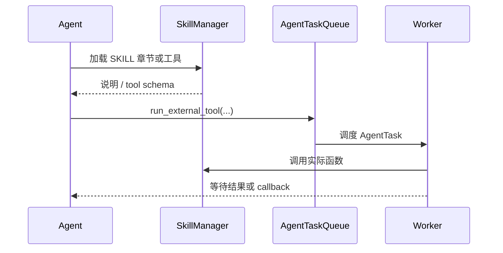

# SKILL 系统

## 定位

TIYA 的 SKILL 是一份面向 Agent 的能力说明，也可以携带工具代码、脚本和资源。它解决的不是 Python 模块怎么 import，而是下面几个 Agent 工程问题：

- Agent 如何知道系统有哪些能力。
- 大段工具说明如何避免一次性占满 Context。
- 能力说明如何和实际可调用函数关联。
- 上下文压缩后如何恢复已经使用过的能力。

内置 SKILL 位于 `data/skill/`。每个 Agent 还拥有自己的 skill 目录，`SkillManager` 在初始化时扫描和注册其中的能力。

## 一个 SKILL 的结构

最小结构是一个包含 `SKILL.md` 的目录：

```text
my_skill/
  SKILL.md
  tools.py          可选：附属 Python 工具
  scripts/          可选：独立执行脚本
  references/       可选：参考资料
  assets/           可选：图片或其他资源
```

`SKILL.md` 使用 YAML front matter 描述身份，其余部分使用 Markdown 标题组织说明：

```markdown
---
name: my_skill
description: 说明何时使用这个能力，以及它能解决什么问题
version: 0.1.0
metadata:
  category: demo
---

# Usage

## 应当使用

- 适用场景。

## 不应使用

- 不适用场景。

# Tools

## query

参数、返回值和错误语义。
```

`name` 和 `description` 是必填字段。名称用于 Agent 查找和工具来源映射，描述会进入 Agent 初始化 prompt，因此应短而明确；详细步骤应放在正文中按需读取。

## 渐进式加载

SKILL 不会在启动时把全部正文塞进 Agent Context。注册过程先把 Markdown 解析为标题树：

```text
list_skills
    -> 只返回名称和描述

load_skill(skill_name)
    -> 返回章节标题树，不返回正文

get_skill_content(skill_name, title_tree)
    -> 只重建指定章节的 Markdown
```

例如 Agent 可以先看到：

```json
{
  "private_chat": {
    "Usage": {
      "应当使用": {},
      "不应使用": {}
    },
    "附属工具说明": {
      "add_memory": {},
      "query_memory": {}
    }
  }
}
```

如果当前任务只需要查询记忆，就只读取 `query_memory` 相关章节。这样能力库可以持续增长，而每次任务只支付必要的上下文成本。

## 工具注册

SKILL 可以通过 `load_tools_from_python_file` 动态加载 Python 文件。管理器只注册该文件中定义的公开函数和协程函数，并根据函数签名构造 OpenAI tool schema。

实际工具不会直接混入所有内置函数。Agent 通过两级接口使用它们：

```text
load_external_tool(source_name, tool_name)
run_external_tool(source_name, tool_name, arguments)
```

`source_name` 保留工具来源，避免多个 SKILL 中同名函数发生语义混淆。每个工具还可以设置默认的 `wait` 和 `callback` 策略：立即读取类工具通常等待结果，网络和耗时工具通常后台运行并在完成后 callback。

## 与任务机协作

外部工具最终进入统一的 `AgentTask`：



这意味着 SKILL 只定义“能力是什么、怎样使用”，任务机仍统一负责超时、重试、依赖和结果回传。能力作者不需要重新实现一套后台执行协议。

## 上下文压缩后的恢复

Context 压缩会扫描当前窗口中的工具调用，找出：

- 已加载的外部工具。
- 曾通过 `get_skill_content` 读取的 SKILL 章节。

这些内容会合并成 pinned 信息写入新窗口。相同 SKILL 的标题树会去重合并，因此压缩不会因为重复读取而无限复制内容。

压缩后的恢复提示仍要求 Agent 检查能力是否完整。这样既保留已经确认的重要说明，也允许任务变化后重新加载其他章节。

## 内置 SKILL

仓库目前包含以下基础能力：

| SKILL | 作用 |
| --- | --- |
| `group_chat` | 群消息、群画像、成员画像、记忆和群聊业务工具 |
| `private_chat` | 私聊消息、用户 Persona、记忆和一对一业务工具 |
| `websearch` | 搜索、网页提取、URL map 和原始抓取 |
| `skill_installer` | 安装、发现、读取和管理其他 SKILL |

Web 搜索和聊天 SKILL 展示了两种典型模式：前者偏后台异步工具，后者偏当前会话内的结构化状态访问。

## 文件与执行边界

SKILL 管理器为常见文件操作设置了基本限制：配置目录不可读取或修改，写入被限制在 `%TEMP%` 或 `%SKILL%` 下，删除只允许发生在临时目录。路径占位符使 Agent 不需要知道本机绝对路径。

但动态加载 Python 文件和执行附属脚本本质上仍是在本机运行代码，**SKILL 不是安全沙箱**。真正的运行沙箱目前仍是 TODO。只应安装和执行可信来源的 SKILL；不要将未知仓库中的脚本直接交给运行中的 Agent。

项目的 Agent 权限管理模块也尚未完成，当前不能针对每个 SKILL、工具或具体操作分别授权。路径限制只保护少数内置文件接口，不能限制任意 Python 工具拥有的能力。

SKILL 文档中也不应写入 API Key、Cookie 或访问令牌。密钥属于 `config/config.yaml` 或运行环境，而不是能力说明的一部分。

完整风险和计划边界参见[已知限制](limitations.md)。
